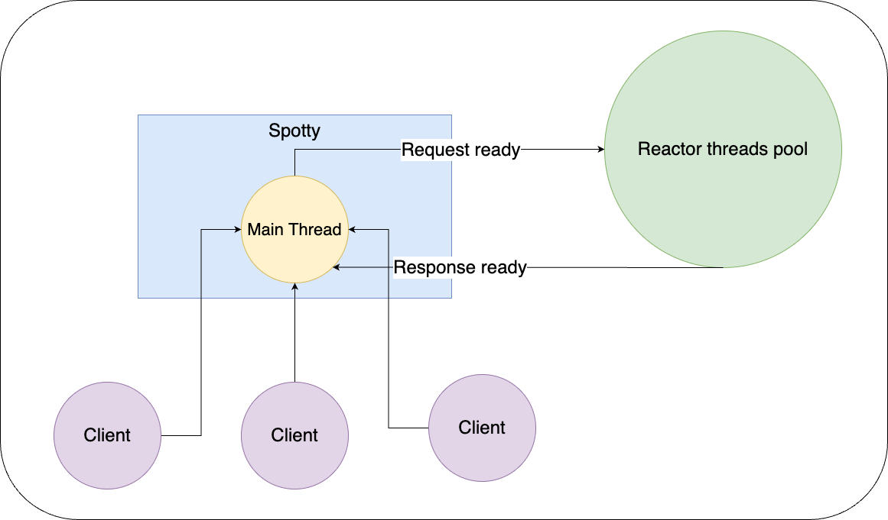

# Spotty Web Server
Spotty is a fast, lightweight java web server with a simple API and rich functionality.

### Why Spotty?
Common java web servers have simple architecture. Each connection to the server is managed as a separate thread.
<p align="center">
  
</p>

For example, if you start a server with 10 threads then your server can handle 10 connections concurrently, 
and the 11th connection will wait when some thread will be free.

This is simple and works fine, but what if you need to serve 1000 or 5000 connections concurrently? 
Can you start a server with 5000 threads? Yes, if your machine is powerful enough. 
But more threads does not mean that it will work efficiently, 
and for each thread JVM allocates RAM to the stack. So, this is not a good way to scale. 
With Spotty, one server can handle a lot of connections without creating one thread per connection 
and that saves a lot of resources.

Spotty uses the Java NIO non-blocking socket channel, 
which accept connections in Spotty's main thread and switches between connections to read/write requests 
and responses. This is similar to one CPU that can switch context between threads.

When a request is ready to handle, Spotty sends it to the queue, and Reactor (threads pool) will handle it. 
So each request will be handled in a separate Reactor thread, 
but Spotty does not create one thread per connection.
<p align="center">
  
</p>

## Getting started

maven dependency
```xml
<dependency>
  <groupId>com.spotty-server</groupId>
  <artifactId>core</artifactId>
  <version>1.0.0</version>
</dependency>
```

gradle dependency
```groovy
dependencies {
    implementation "com.spotty-server:core:1.0.0"
}
```

## Code Example

Hello world example:
```java
import spotty.Spotty;

public class App {
    public static void main(String[] args) {
        final Spotty spotty = new Spotty();
        spotty.start();

        spotty.get("/hello", (request, response) -> "Hello World");
    }
}
```
route will be available on `http://localhost:4000/hello`

If you need to wait for when the server will be started, you can use `awaitUntilStart`
```java
spotty.start();
spotty.awaitUntilStart();

// your code
```

To stop the server:
```java
spotty.stop();
```

To wait until the server will be stopped:
```java
spotty.stop();
spotty.awaitUntilStop();

// your code
```

other:
```java
spotty.port(); // get server port
spotty.host(); // get server host, for example: localhost
spotty.hostUrl(); // get server url, for example: http://localhost:4000
spotty.isStarted(); // return true when server has started
spotty.isRunning(); // return true when server is running
spotty.connections(); // return number of current connections
```

## Routes
The main code block of Spotty web server is based on the route. The route is the entry point of a request to the server.

Within a route, Spotty web server supports these HTTP methods:
```java
spotty.get("/", (request, response) -> {
    // your code
});

spotty.post("/", (request, response) -> {
    // your code
});

spotty.put("/", (request, response) -> {
    // your code
});

spotty.patch("/", (request, response) -> {
    // your code
});

spotty.delete("/", (request, response) -> {
    // your code
});

spotty.head("/", (request, response) -> {
    // your code
});

spotty.trace("/", (request, response) -> {
    // your code
});

spotty.connect("/", (request, response) -> {
    // your code
});

spotty.options("/", (request, response) -> {
    // your code
});
```

The route path template can include named parameters which are accessible via the `param()` method on the request object
```java
spotty.get("/hello/:name", (request, response) -> {
    return "Hello " + request.pathParam("name");
});
```

The route path template can also include wildcard parameters
```java
spotty.get("/hello/:name/say/*/something", (request, response) -> {
    return "Hello " + request.pathParam("name");
});
```

You can restrict your route by accept-type:
```java
spotty.get("/hello", "application/json", (request, response) -> "Hello JSON");
spotty.get("/hello", "application/xml", (request, response) -> "Hello XML");
```

## Delete route
A route can be removed by the `removeRoute` function
```java
import spotty.common.http.HttpMethod.*;

spotty.clearRoutes(); // remove all routes
spotty.removeRoute("/route/path"); // remove all routes with path /route/path 
spotty.removeRoute("/route/path", GET); // remove all routes with path /route/path and http method GET
spotty.removeRoute("/route/path", "application/json", GET); // remove route with path /route/path, application/json accept-type and http method GET
```

## Path groups
Routes can be grouped, and this is very useful when you have a lot of them. 
To do this, call the `path()` method. This method takes a String prefix, and offers the capability to be able to declare routes, nested paths, and filters inside it.
```java
spotty.path("/api", () -> {
    spotty.before("/*", (req, res) -> log.info("got request before filter"));
    
    spotty.path("/email", () -> {
        spotty.post("/add", Email::add);
        spotty.put("/update", Email::update);
        spotty.delete("/delete", Email::delete);
    });
    
    spotty.after("/*", (req, res) -> log.info("got request after filter"));
});
```

## Request
Request information is provided by the request object:
```java
request.protocol();                       // the protocol, e.g. HTTP/1.1
request.scheme();                         // http
request.method();                         // http method GET, POST, PUT ...etc
request.path();                           // request path "/hello"
request.contentLength();                  // request content length in bytes
request.contentType();                    // request content type
request.host();                           // the host of client
request.ip();                             // the IP of client
request.port();                           // the port of client from which it sent request to the server
request.cookies();                        // request cookies sent by the client
request.headers();                        // HTTP request headers sent by the client
request.pathParams();                     // map of all path params
request.pathParam(String name);           // value of path parameter
request.queryParamsMap();                 // map of all GET query params
request.queryParams();                    // all query param names
request.queryParams(String name);         // query param values
request.queryParam(String name);          // first query param value
request.attach(Object attachment);        // set an attachment object (can be fetched in filters/routes later in the chain)
request.attachment();                     // get attachment object
request.session();                        // session managment object
request.body();                           // request body bytes
request.bodyAsString();                   // request body as string
```

## Response
Response information can be obtained from the response object:
```java
response.status();                                  // get response http status
response.status(HttpStatus status);                 // set response http status
response.contentType();                             // get response content type
response.contentType(String contentType);           // set response content type
response.body();                                    // get response body bytes
response.bodyAsString();                            // get response body as string
response.body(String body);                         // set response body string
response.body(byte[] body);                         // set response body bytes
response.contentLength();                           // get response body content length (calculated from body.length)
response.headers();                                 // get response http headers
response.addHeader(String name, String value);      // add http header to the response
response.addHeaders(HttpHeaders headers);           // add group of headers to the response
response.addHeaders(Map<String, String> headers);   // add group of headers to the response
response.replaceHeaders(HttpHeaders headers);       // replace all headers with a given parameter
```

## Headers
```java
final HttpHeaders headers = response.headers(); // request.headers(); or new HttpHeaders();

headers.add(String name, String value);                 // add header to the container
headers.add(HttpHeaders headers);                       // add group of headers to the container
headers.add(Map<String, String> headers);               // add group of headers to the container
headers.get(String name);                               // get the header by a specified name, or null if there's no header with that name
headers.remove(String name);                            // remove header by name
headers.has(String name);                               // returns true if this container contains a header for the specified name
headers.hasNot(String name);                            // returns false if this container contains no header for the specified name
headers.hasAndEqual(String name, String value);         // returns true if this container contains a header for the specified name and the header value is equal with the given value
headers.size();                                         // returns the number of headers in this container
headers.isEmpty();                                      // returns true if this container contains no headers.
headers.isNotEmpty();                                   // returns true if this container contains headers
headers.forEach(BiConsumer<String, String> action);     // performs the given action for each header until all entries have been processed or the action throws an exception.
headers.clear();                                        // remove all headers
headers.copy();                                         // returns a copy of this container
```

## Cookies
Spotty has the ability to generate and remove cookies.

```java
response.cookie(Cookie cookie);                         // add fully builded cookie to the response
response.cookie(String name, String value);             // add cookie with name and value
response.cookie(String name, String value /* etc */ );  // further standard cookie parameters are also supported

response.removeCookie(String name);                // remove cookie by name
response.removeCookie(String path, String name);   // remove cookie by path and name
```

## Session
By default, session is disabled and `request.session()` returns `null`. To enable it just call `spotty.enableSession()` 
```java
final Session session = request.session();

session.expires();                                          // get expired timestamp
session.expires(Instant expires);                           // set expired timestamp
session.ttl(long seconds);                                  // set expiry time in seconds from now + seconds
session.put(Object key, Object value);                      // put data to the session
session.putIfAbsent(Object key, Object value);              // put data to the session if key is absent
session.computeIfAbsent(Object key, Function mapper);       // compute value if key is absent
session.computeIfPresent(Object key, BiFunction mapper);    // compute value if key is present
session.compute(Object key, BiFunction mapper);             // compute value for the given key
session.putAll(Map<Object, Object> data);                   // put all data to the session
session.get(Object key);                                    // get value by the specified key
session.getOrDefault(Object key, Object defaultValue);      // get value by the specified key if it is present, otherwise returns the default value 
session.size();                                             // get the number of key-value in this session
session.isEmpty();                                          // return true if this session contains no key-value mappings
session.isNotEmpty();                                       // return true if this session contains key-value mappings
session.remove(Object key);                                 // removes the mapping for a key from this session if it is present 
session.clear();                                            // remove all data from this session
session.keys();                                             // returns a Set view of the keys contained in this session
session.values();                                           // returns a Collection view of the values contained in this session
session.entrySet();                                         // returns a Set view of the mappings contained in this session
session.has(Object key);                                    // returns true if this session contains a mapping for the specified key
session.hasNot(Object key);                                 // returns true if this session contains no mapping for the specified key
session.hasAndEqual(Object key, Object value);              // returns true if this session contains a value for the specified key and that value is equal with the given parameter
session.forEach(BiConsumer action);                         // performs the given action for each key-value until all entries have been processed or the action throws an exception
```

## Redirects
You can trigger a browser redirect:
```java
response.redirect(String location);                     // trigger Moved Permanently redirect
response.redirect(String location, HttpStatus status);  // trigger redirect with your status
```

## Halt
To stop a filter or route, run the `halt` function: 
```java
spotty.halt(HttpStatus status);               // Immediately stops a request with http status
spotty.halt(HttpStatus status, String body);  // Immediately stops a request with http status and body
```

## Filters
`Before filters` evaluate before each route. If you throw an exception in the `before filter`, then the actual route will not run.
```java
spotty.before((request, response) -> {
    final User user;
    // get user code
    
    if (user.hasNotPermissions()) {
        spotty.halt(FORBIDDEN); // or throw your own exception
    }
});
```

Optionally, you can pass a route template path, http method and content-type to restrict the filter for the matched path, http method and content-type
```java
// before filter for any request that matches given path
spotty.before("/api/user/file/*", (request, response) -> {
    // your code    
});

// before filter for any request that matches given path and http method
spotty.before("/api/user/file/*", GET, (request, response) -> {
    // your code    
});

// before filter for any request that matches given path, http method and accept-type
spotty.before("/api/user/file/*", POST, "application/pdf", (request, response) -> {
    // your code    
});
```

`After filters` evaluate after each request even if in `before filter` or route there was an exception. 
Same as for `before filter`, you can optionally pass a route template path, http method and content-type to restrict the filter for the matched path, http method and content-type.
```java
// attach the Instant object to the request to save the start timestamp of the beginning of the request
spotty.before((request, response) -> request.attach(Instant.now()));

// calculate the request time and set it to the custom header
spotty.after((request, response) -> {
    final Instant start = (Instant) request.attachment();
    final long millis = start.until(Instant.now(), MILLIS);

    response.addHeader("Request-Duration", Long.toString(millis));
});
```

## Error handling
You can register exception handlers to customise error responses:
```java
spotty.exception(CustomException.class, (exception, request, response) -> {
    // your code
    
    response
        .status(BAD_REQUEST)
        .contentType("application/json")
        .body("your json body")
    ;
});
```

Route not found
```java
spotty.notFound((exception, request, response) -> {
    // your code    
});
```

## Static files
You can enable static files that are included in the class path in the root of the `resource` directory
```java
spotty.staticFiles("/public");
```
For example, this file will be available in the path `http://localhost:4000/public/image.jpeg`

To store files in a child directory, for example `resource/images`
```java
spotty.staticFiles("/images", "/public");
```

If your files are located in an external directory, you can register the directory
```java
spotty.externalStaticFiles("/absolute/path/to/directory", "/public");
```

### Files cache
To prevent reading files from disk every time, you can enable the cache
```java
// cacheTtl - cache time-to-live in seconds
// cacheSize - maximum number of elements in the cache
spotty.staticFilesCache(long cacheTtl, long cacheSize);
```

## GZIP, DEFLATE
You can gzip or deflate your responses by simply adding a header to the response object
```java
// gzip all GET /hello responses
spotty.get("/hello", (request, response) -> {
    response.addHeader(HttpHeaders.CONTENT_ENCODING, "gzip");
    // or 
    response.addHeader(HttpHeaders.CONTENT_ENCODING, "deflate");
});

// gzip all responses
spotty.after((request, response) -> {
    response.addHeader(HttpHeaders.CONTENT_ENCODING, "gzip");
});
```

## Server settings
To start the server on a custom port:
```java
int port = ...;
final Spotty spotty = new Spotty(port);
```

With Spotty builder you can create a server instance with more advanced settings:
```java
final Spotty spotty = Spotty.builder()
    .port(int port) // server port
    .maxRequestBodySize(int maxRequestBodySize) // maximum request body size in bytes that server can accept, 10Mb by default

    // when the session is expired it must be removed from memory
    // to do this, Spotty has a watcher that checks every 10 seconds (by default) if the session is expired and is ready to be removed
    // to customise this you can use this builder function
    .sessionCheckTickDelay(int sessionCheckTickDelay, TimeUnit timeUnit)
    
    .defaultSessionTtl(long defaultSessionTtl) // set default session time-to-live (1 day by default)
    .defaultSessionCookieTtl(long defaultSessionCookieTtl) // set default SSID cookie time-to-live (Spotty session id cookie)
    .reactorWorkers(int reactorWorkers) // number of threads that handles the queue of requests (24 by default)
    .build();
```